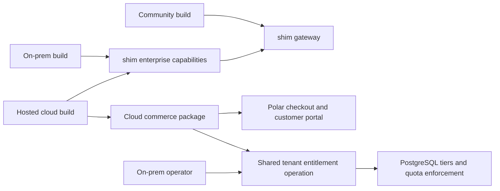

# Cloud subscriptions without payments in on-prem distributions

Status: proposal, not implemented. Inspected 2026-09-11 against backend
`f3d9ff1` on `feat/customer-operated-enterprise` and dashboard `a01293d` on
`feat/enterprise-dashboard`. Backend [PR #40](https://github.com/GetSHIM/shim/pull/40)
is open. This proposal changes neither licence terms nor production behavior.

The user selected fixed monthly/yearly plans with included quotas and confirmed
that there are no paying Lemon Squeezy subscriptions to migrate.

## Recommendation

Keep one shared gateway implementation. Add a small **cloud-only Python
package and application composition**, with separate cloud and on-prem build
artifacts. Both consume the enterprise capabilities; only cloud consumes Polar.



The distinction is deployment composition, not another paid tier. The existing
`enterprise` tier, identity-provider selection, production environment, and
offline installation licence must not determine whether payment code is shipped.

This needs neither a gateway fork nor a separate billing microservice. Native
Python packages, the existing uv workspace, and explicit FastAPI composition
are sufficient. An environment switch alone cannot remove code from an image.

## What the inspection found

| Evidence | Consequence |
| --- | --- |
| [Roadmap T01 and D01](../../../ENTERPRISE_ROADMAP.md) retire Lemon Squeezy and select operator provisioning. | Correct for on-prem, but cloud commerce needs its own supported composition. |
| [Plan activation](../src/shim_enterprise/tenants/plans.py) preserves usage and atomically updates the organization and active keys, but sets `billing_source="operator"`. | Reuse its entitlement operation; do not call it unchanged from a Polar webhook. |
| [Management subscription view](../src/shim_enterprise/api/v1/management.py) retains plan/status/source/entitlements and removes checkout/portal data. | Keep this shared entitlement read contract; add cloud commerce endpoints separately. |
| [Organization models](../src/shim_enterprise/tenants/models.py) retain historical subscription fields and webhook receipts. | T01 did not delete the usage/accounting foundation or historical records. |
| [Cloud Build](../../cloudbuild.yaml) and [customer release](../../.github/workflows/enterprise-release.yml) both build `ee/Dockerfile`. | Cloud production and customer delivery must select different artifacts. |
| [Enterprise Dockerfile](../Dockerfile) installs `--all-packages`. | Adding another workspace member without changing package selection would install cloud dependencies in the on-prem build, or break its incomplete workspace context. |
| [Quota model](../src/shim_enterprise/billing/models.py) and [ledger](../src/shim_enterprise/billing/ledger.py) use API-key and optional team counters. | A workspace subscription allowance is not currently enforced as an organization-wide pool. |
| [Dashboard subscription page](../../../SHIM_LP/app/dashboard/workspace/subscription/page.tsx) always describes operator-managed changes; [dashboard Dockerfile](../../../SHIM_LP/Dockerfile) builds the same application. | Restoring a purchase button alone would not create a cloud/on-prem distribution boundary. |

## Backend boundary and ownership

Use this additional package under the existing enterprise licence region:

```text
ee/src/shim_enterprise/     shared enterprise capabilities and on-prem app
ee/cloud/pyproject.toml     shim-cloud; depends on shim-enterprise and Polar
ee/cloud/src/shim_cloud/    cloud app, commerce endpoints, Polar sync
```

`shim_cloud -> shim_enterprise -> shim` is the dependency direction. Shared
enterprise code must not import `shim_cloud` or either Polar import namespace.
Keep cloud settings, tests, scripts, and any new commerce migrations under
`ee/cloud/`. Preserve the existing Elastic-2.0 boundary and matching package
metadata; a new top-level Apache-licensed `cloud/` directory would be the wrong
place for this code.

`create_cloud_app()` calls `create_enterprise_app()` and explicitly adds the
cloud router. Preserve the enterprise factory's lifespan, error handling,
authentication, offline licence check, and inference path. A cloud outbox
entrypoint composes the existing publisher with cloud handlers and runs the
existing worker. It replaces the ordinary outbox entrypoint in cloud deployment;
do not run a competing worker that can claim cloud events without handling them.

Extract only the existing locked tier/key update into one shared tenant
operation. Operator activation retains its current behavior. Cloud synchronization
calls the same operation within the transaction that records its billing state.
Keep organization-first locking used by key creation, active-key propagation,
revoked-key preservation, and existing quota/reservation/ledger values. Provider
state and customer-session URLs are owned by cloud commerce, not by the gateway.

Reuse the existing generic organization billing snapshot through the tenant
operation: it already stores customer/subscription IDs, source/status, product
reference, period end, and cancellation state. Do not create a second subscription
model for fixed plans. Cloud owns the interpretation of Polar events; the shared
tenant module owns writes to organization state.

Reuse the transactional outbox for durable work and deduplication. A synchronization
revision or durable checkout result may need a small additive persistence change;
the current historical receipt table does not provide those guarantees. Keep
any new cloud-specific operation tables/migrations in the cloud package, with a
separate migration version table if needed, after enterprise migrations. Do not
edit historical enterprise revisions, reinterpret legacy receipts, or make
enterprise Alembic import cloud models. Generic quota schema changes remain
in the shared enterprise migration history.

Extend the existing ownership/import tests and route-profile exporter for the
third composition. Define the small public enterprise contract consumed by
cloud explicitly; do not use unrestricted private ORM writes across packages.

## Subscription flow

1. **Choose a plan.** The website retains the selected plan and monthly/yearly
   interval through sign-in. A signed-in workspace owner requests checkout.
   The server derives the organization from authenticated membership and maps
   the allowed plan/interval to a configured Polar product. Never accept an
   arbitrary organization ID, price, product, or redirect destination as authority.
2. **Checkout.** Associate the purchase using Polar's `external_customer_id`
   set to the shim organization UUID. Keep the Polar merchant organization ID
   distinct from that customer identifier. Record the operation before the
   external effect, following the repository's outbox rule. Return a completed
   checkout URL or a pending operation that the UI can poll. The browser goes
   to hosted Polar Checkout; it does not handle payment credentials.
3. **Activate.** Verify the raw webhook body, headers, signature, and timestamp.
   Validate the merchant/environment/customer binding. Commit a deduplicated
   synchronization intent keyed by the verified `webhook-id` before returning
   success. A success redirect never grants access.
4. **Synchronize.** A cloud handler reads current Polar customer/subscription
   state and applies the mapped tier in PostgreSQL. Use durable per-organization
   synchronization revisions to prevent concurrent stale fetches overwriting
   newer state; refetch after a conflict. A webhook timestamp alone is not a
   concurrency mechanism. No database transaction spans the Polar network call.
5. **Manage billing.** The owner requests a fresh customer-portal session for
   the authenticated workspace. Polar handles payment methods, invoices,
   cancellation, and configured plan changes. Never persist a portal URL as
   a permanent management link or log its bearer material.

Suggested cloud-only API surface: checkout creation, operation/status read,
portal-session creation, and a Polar webhook. The existing
`/api/v1/management/subscription` continues to describe effective local access.
Use owner-only payment mutations initially; an admin role should not implicitly
gain authority to purchase or cancel a workspace subscription.

Use Polar `customer.state_changed` for synchronization and a cloud reconciliation
job to repair missed deliveries, including cancellations and renewal boundaries.
An API outage must preserve the last verified local state and leave retryable
work; it must not be interpreted as "no subscription." Alert on stalled/dead-letter
work. Define a bounded stale-state policy before launch. Inference must never
call Polar. See [Customer State](https://polar.sh/docs/integrate/customer-state)
and [webhook delivery](https://polar.sh/docs/integrate/webhooks/delivery).

Unknown product IDs must not grant a paid tier. Protect operator-managed
contracts from automated overwrite. Scheduled cancellation retains access through
the effective end; immediate revocation removes paid access after synchronization.
Specify past-due/grace behavior explicitly and verify it in sandbox rather than
equating "cancellation requested" or "payment failed" with an immediate terminal
state. Downgrades preserve customer data, audit evidence, and usage history.
[Polar subscription behavior](https://polar.sh/docs/features/subscriptions/introduction).

## Fixed plans and included quotas

Start with the existing plan identifiers: `free`, `managed` (displayed as Solo
Pro), `agency`, and operator-managed `enterprise`. Keep free signup local.
Configure paid monthly/yearly product mappings only for the plans offered for
self-service. Prices and allowances need to agree between Polar products,
`tier_definitions`, and the existing website plan metadata. This proposal does
not change their commercial amounts.

**Enforce the purchased allowance across the organization.** Current tier quotas
are per API key, so additional keys can multiply a plan allowance. Extend the
existing PostgreSQL quota reservation/settlement machinery with an organization
scope, alongside key/team limits. This is a shared quota capability, not Polar
logic. Verify concurrent requests across keys, refunds, reconciliation, new keys,
and rotation against the same organization counter. Do not build an aggregate
check that races separately from reservation. Make the organization allowance
explicit local policy; preserve existing on-prem per-key/team behavior unless
the operator configures an organization cap.

Recommended initial reset policy: keep the existing UTC calendar-month quota
windows and state them clearly in the UI. Annual billing still provides a monthly
allowance. Upgrades, downgrades, renewals, cancellation, and key creation do not
reset consumed usage. A downgrade below already-consumed usage blocks new
admission according to the existing quota policy. If billing-anniversary resets
are required instead, that is an explicit accounting change before launch.

These allowances concern gateway requests/tokens. Keep provider-cost accounting
distinct from the platform subscription; this proposal does not introduce
provider credit resale, Polar meters, overage invoicing, seats, trials, or add-ons.

## Polar SDK selection: verified compatibility issue

As inspected on 2026-09-11, PyPI's stable `polar-sdk` is **0.32.0**, importing
`polar_sdk`. The current Python documentation demonstrates the new preview
namespace `polar.v2026_04`; the latest preview inspected was **1.0.0a21**.
Do not mix these examples or float between them.
[PyPI](https://pypi.org/project/polar-sdk/),
[Python SDK documentation](https://polar.sh/docs/integrate/sdk/python).

Polar says secrets created from 8 September 2026 use Standard Webhooks. The
0.32.0 wheel's verifier still encodes the full secret as the legacy HMAC key.
An isolated local probe confirmed that it rejects a synthetic new-format
signature which `standardwebhooks.Webhook(secret).verify(...)` accepts.
[Signing instructions](https://polar.sh/docs/integrate/webhooks/delivery).

Recommended initial integration: pin stable `polar-sdk==0.32.0` for API calls
and declare the maintained `standardwebhooks` library directly in the cloud
package for new-secret verification. Validate only the event data this integration
consumes after successful signature verification. Do not implement HMAC manually.
The SDK has async checkout, customer-state, and customer-session methods; these
were confirmed by importing the pinned package. Pin the endpoint/API contract
and test real sandbox payloads before launch. The preview is an alternative
only if a required feature justifies adopting a prerelease deliberately.

## Dashboard and delivered artifacts

Build `cloud` and `onprem` dashboard compositions from shared dashboard code.
Use an explicit build profile independent of Supabase/OIDC selection. Resolve
the subscription page and navigation to separate modules at build time: cloud
gets purchase/manage controls, on-prem gets plan/usage information and operator
guidance. Do not add a Polar JavaScript SDK when the Python backend plus a hosted
redirect covers the flow.

Exclude commerce modules and cloud purchase routes from the on-prem build input
or build-time import graph. Verify both server output and browser chunks; a
runtime conditional, hidden button, or route returning 404 is insufficient proof
that its implementation is absent. Test marketing links as well as the dashboard
so the delivered installation does not send users into hosted purchase flows.

| Artifact | Required composition |
| --- | --- |
| Community wheel/image | `shim-gateway` only |
| Customer enterprise wheel/image and offline bundle | `shim-enterprise` + `shim-gateway`; no cloud wheel, Polar SDK, commerce routes, scripts, or new commerce migrations |
| Hosted image | `shim-cloud` + the exact matching enterprise/community packages |
| Customer dashboard image | On-prem build with no cloud commerce modules |
| Hosted website/dashboard | Cloud build with checkout and portal controls |

Replace release-image `--all-packages` with explicit package selection, provide
the workspace metadata required for locked resolution, and keep cloud source
out of customer build contexts. Select the cloud Dockerfile/factory/outbox
entrypoint and cloud migration job in Cloud Build. Customer releases and offline
bundles retain enterprise artifacts and no Polar credentials. Inspect image
layers, installed packages, routes, and dashboard chunks in CI; do not rely on
configuration assertions alone. Keep release publication separate from deployment.

Existing inert subscription-history fields and the entitlement read endpoint
can remain on-prem, as T01 requires. The exclusion guarantee concerns executable
commerce integration and dependencies; dropping retained schema/history would
be a different change.

## Implementation and acceptance

1. **Composition boundary:** add cloud package, explicit builds and cloud OpenAPI
   profile, plus absence/import checks. Keep the enterprise factory operable
   with cloud sources and Polar packages physically absent.
2. **Entitlement/quota correctness:** share the existing tier-update operation,
   add organization quota reservation, and verify all affected key/team and
   accounting behavior before selling a pooled allowance.
3. **Polar sandbox flow:** implement checkout, signed durable synchronization,
   status and portal endpoints, and reconciliation. Test invalid signatures,
   duplicate/concurrent/reordered deliveries, unknown products, wrong tenants,
   double checkout, cancellation timing, past due, recovery, and provider outage.
4. **Dashboard and release:** wire the selected plan through login, show pending
   activation and actionable failures, separate the on-prem build, regenerate
   contracts, and run the repository gates and a disconnected customer smoke test.

Narrow roadmap T01/D01 to retirement of legacy/on-prem commerce while preserving
operator provisioning; record cloud subscriptions as additional scoped work.
Add payment-code absence to T04/T05/T09/T10 acceptance. Keep T01's history and
accounting guarantees, and do not claim this proposal completes pending Phase 1
operator/release acceptance. The shared backend PR and dashboard changes must
land compatibly; a merge alone does not deploy production.

No Lemon Squeezy migration or dual-provider bridge is needed for this fresh
launch. Production launch still needs the actual Polar organization, products,
credentials, webhook endpoint, and the selected payment-failure policy.

Checks performed for this inspection: existing module-ownership tests **9 passed**;
isolated stable SDK import/signature probe, targeted backend Ruff, and dashboard
typecheck/lint passed. The plan integration tests could not collect because the
required database/Redis/secret settings were absent. No real checkout, sandbox
webhook delivery, database integration suite, or disconnected image build was
run. Runtime code and deployment configuration were not changed.
